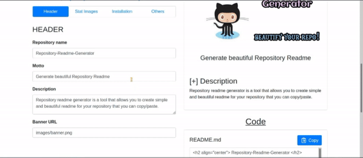

<h2 align="center">Readme-Generate </h2>

<h4 align="center"> Generate Readme </h4>

 
    
    
    
    

### [+] Description
readme generator is a tool that allows you to create simple and beautiful readme for your repository that you can copy/paste.

### [+] Instructions

- Go to: <a href="https://iamaloksy.github.io/readme-generate/">Readme-Generate</a>
- Fill any inputs you like
- Copy the code generated in the Code section
- Paste the copied code into the readme file of the repository and save
- Enjoy!

### [+] Preview

### [+] Credits 
<a href="https://github.com/arturssmirnovs/github-profile-readme-generator">Arturssmirnovs</a>

### [+] Find me on 
 

